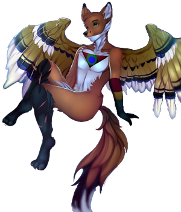
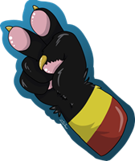

# Ahoy There

<table>
	<tr>
		<td>You are visitor</td>
		<td></td>
	</tr>
</table>

<table border="0">
	<tr>
		<td>
			
I'm Tessa or Florian. I'm an eager developer committed to carving a path for open-source accessibility tools to annihilate the daily challenges my disability throws at me... and also having lots of fun with technology and coding!

			
I want to bring back the DIY grime and elegaic aesthetic of the old internet. Everyone with anything to say should build themself a little corner exactly how they like it, and I suppose that's what I'm trying to do.

			
Many of my repos on here are stubs for things I've worked on for a time, or planned to start but never got off the ground, but there are finished projects too!

			<h3>Current Work</h3>
			
I am currently putting a lot of work into developing <a href="https://github.com/FlorianEagox/WeeaBlind">WeeaBlind</a> which has just seen its first BINARY RELEASE

			
This is a program to dub videos into other languages using a suite of advanced AI tools. I've been working on it on and off for about a year and it's come a long way!

		</td>
		<td>
			
		</td>
	</tr>
</table>

## Check Out my Website and Blog!

You can learn more about me and see more of my work, art, and wwritting at

===>>> https://tessapainter.com <<<===

<a href="https://tessapainter.com"><svg width="103" height="89" class="strokeless" data-v-988bc44a="" data-v-1a479c7e=""><defs id="genericDefs" data-v-988bc44a=""></defs> <g data-v-988bc44a=""><g style="fill:red;stroke-linecap:round;stroke:red" data-v-988bc44a=""><path d="M1 1 L51 87 L101 1 Z" style="stroke:none" data-v-988bc44a=""></path></g> <g style="stroke-linecap:round" data-v-988bc44a=""><path d="M1 1 L51 87 L101 1 Z" style="fill:none" data-v-988bc44a=""></path> <circle r="25.9808" id="circle-green" cx="51" cy="29" style="fill:#0f0;stroke:none" data-v-988bc44a=""></circle> <circle r="25.9808" cx="51" cy="29" style="fill:none" data-v-988bc44a=""></circle> <circle r="15.5885" id="circle-blue" cx="51" cy="29" style="fill:#00f;stroke:none" data-v-988bc44a=""></circle> <circle r="15.5885" cx="51" cy="29" style="fill:none" data-v-988bc44a=""></circle></g></g></svg></a>

I write many articles about tech and programming as well as living with disabilities, and other topics too!

Play Conways Game Of Life

<!--  -->
[Next Step](https://api.tessapainter.com/conway/step?gh=true)
[Reset Board](https://api.tessapainter.com/conway/reset?gh=true)

### Thanks for reading and feel free to reach out!

<!--
**FlorianEagox/FlorianEagox** is a ✨ _special_ ✨ repository because its `README.md` (this file) appears on your GitHub profile.

Here are some ideas to get you started:

- 🔭 I’m currently working on ...
- 🌱 I’m currently learning ...
- 👯 I’m looking to collaborate on ...
- 🤔 I’m looking for help with ...
- 💬 Ask me about ...
- 📫 How to reach me: ...
- 😄 Pronouns: ...
- ⚡ Fun fact: ...
-->
